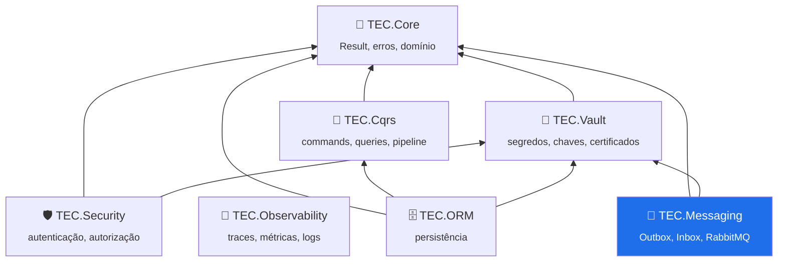

<div align="center">


# 📮 TEC.Messaging

**Mensageria confiável entre serviços: Outbox transacional, consumidor idempotente, contratos de integração versionados e RabbitMQ com retry e DLQ.**

[](https://github.com/tudoemcodigo/lib-tec-messaging/actions/workflows/ci.yml)


[Início rápido](#-início-rápido) · [Documentação](docs/README.md) · [Changelog](CHANGELOG.md)

</div>

---

## 📑 Sumário

- [✨ Por que usar](#-por-que-usar)
- [📦 Pacotes](#-pacotes)
- [🧬 Ecossistema TEC](#-ecossistema-tec)
- [📥 Instalação](#-instalação)
- [🚀 Início rápido](#-início-rápido)
- [📚 Documentação](#-documentação)
- [⚡ Compatibilidade](#-compatibilidade)
- [🛡️ Segurança · 🧪 Testes](#️-segurança--testes)
- [🤝 Contribuição · 🏷️ Versionamento · 📄 Licença](#-contribuição--️-versionamento--licença)

---

## ✨ Por que usar

| Sem o TEC.Messaging | Com o TEC.Messaging |
|---|---|
| Publica no broker dentro do caso de uso: commit falha, evento já saiu (ou o contrário) | **Outbox transacional**: o evento é gravado na mesma transação do agregado e publicado depois |
| Um relay trava a fila inteira numa mensagem com defeito | **Falha isolada**: backoff exponencial por mensagem e status `Dead` depois de N tentativas |
| Publicação dentro de transação longa, com travas no banco | **Reserva (lease)** em transação curta e publicação **fora** da transação |
| Evento de domínio serializado direto para outros serviços | **Contratos de integração** com nome e versão estáveis (`[IntegrationEvent]`) e mapeadores |
| Reentrega processa duas vezes | **Inbox**: registro da mensagem processada na mesma transação do efeito |
| Retry com `Thread.Sleep` e mensagens perdidas | **RabbitMQ** com publisher confirms, filas de espera, DLQ, pausa e administração da DLQ |
| Trace e correlação quebrados entre serviços | **Correlação, causa e `traceparent`** propagados; métricas e spans `TEC.Messaging` |

---

## 📦 Pacotes

| Pacote | Para que serve | Quando instalar | Depende de |
|---|---|---|---|
| `TEC.Messaging` | Envelope, contratos, mapeadores, Outbox/Inbox (abstrações), relay, correlação, métricas | Sempre | `TEC.Core` |
| `TEC.Messaging.SqlServer` | Outbox e Inbox no SQL Server com EF Core, interceptor dos eventos de domínio, administração | Persistência em SQL Server com EF Core | `TEC.Messaging`, EF Core |
| `TEC.Messaging.RabbitMQ` | Publicador com confirms, consumidores com retry/DLQ/pausa, administração da DLQ, health check | Broker RabbitMQ 3.13+/4.x | `TEC.Messaging`, `TEC.Vault`, RabbitMQ.Client 7 |

Os três pacotes saem sempre juntos, com a mesma versão (os satélites usam internos do núcleo).

---

## 🧬 Ecossistema TEC



O TEC.Messaging **não depende** do TEC.Cqrs nem do TEC.ORM: funciona com qualquer `DbContext`. Spans e métricas `TEC.Messaging`
são assinados automaticamente pelo TEC.Observability. Na ordem de publicação, entra depois do ORM.

---

## 📥 Instalação

Feed do GitHub Packages (PAT com `read:packages`):

```bash
dotnet nuget add source https://nuget.pkg.github.com/tudoemcodigo/index.json -n tec-interno -u <usuario-github> -p <PAT>
dotnet add package TEC.Messaging.SqlServer
dotnet add package TEC.Messaging.RabbitMQ
```

---

## 🚀 Início rápido

```csharp
// 1. Contrato de integração (público, versionado) e o evento de domínio (interno)
[IntegrationEvent("vendas.pedido-aprovado", Version = 1)]
public sealed record PedidoAprovadoV1(Guid PedidoId, decimal Total);

public sealed record PedidoAprovado(Guid PedidoId, decimal Total, DateTimeOffset OccurredAt) : IDomainEvent;

// 2. Registro
builder.Services.AddTecMessaging()
    .AddEventType<PedidoAprovadoV1>()
    .Map<PedidoAprovado>(e => new PedidoAprovadoV1(e.PedidoId, e.Total))
    .UseSqlServer<VendasDbContext>()                                  // Outbox/Inbox no banco da aplicação
    .UseRabbitMq(o => o.Exchange = "vendas.eventos")                  // URI no segredo "rabbitmq" do TEC.Vault
    .AddOutboxRelay();

builder.Services.AddDbContext<VendasDbContext>((sp, o) => o.UseSqlServer(conexao).UseTecMessaging(sp));

// 3. No modelo: modelBuilder.AddTecMessaging("vendas");  (e gere a migration)

// 4. No caso de uso: só altere o agregado. O evento vira mensagem no mesmo SaveChanges.
pedido.Aprovar(agora);              // RaiseDomainEvent(new PedidoAprovado(...))
await db.SaveChangesAsync(ct);
```

Consumidor idempotente:

```csharp
public sealed class Faturamento(RabbitMqConsumerDependencies deps, IServiceScopeFactory scopes) : RabbitMqConsumer(deps)
{
    protected override QueueDefinition Queue { get; } = new("financeiro.faturamento", ["pedido-aprovado"]);

    protected override async Task<ConsumeResult> HandleAsync(ReceivedMessage message, CancellationToken ct)
    {
        await using var scope = scopes.CreateAsyncScope();
        if (!await scope.ServiceProvider.GetRequiredService<IInboxStore>().TryBeginAsync(message.Envelope.MessageId, "faturamento", ct))
            return ConsumeResult.Completed;                      // reentrega: já processada
        // ... efeito ...
        await scope.ServiceProvider.GetRequiredService<FinanceiroDbContext>().SaveChangesAsync(ct);
        return ConsumeResult.Completed;
    }
}
```

---

## 📚 Documentação

| Arquivo | O que responde |
|---|---|
| [📜 Contratos de integração](docs/contratos-de-integracao.md) | Como nomear e versionar eventos, mapear eventos de domínio e registrar com AOT |
| [📤 Outbox](docs/outbox.md) | Como o evento entra no Outbox, como o relay publica, falhas, `Dead` e administração |
| [📥 Inbox](docs/inbox.md) | Como tornar o consumidor idempotente |
| [🐇 RabbitMQ](docs/rabbitmq.md) | Topologia, retry, DLQ, pausa, administração e health check |
| [📡 Telemetria](docs/telemetria.md) | Spans, métricas e correlação |
| [🛡️ Segurança](docs/seguranca.md) | Segredos, limites e dados nas mensagens |
| [🧪 Testes](docs/testes.md) | Categorias, integração local e carga |
| [🛠️ Desenvolvimento](docs/desenvolvimento.md) | Build, modo local e publicação |

---

## ⚡ Compatibilidade

| Item | Suporte |
|---|---|
| .NET | 8 (LTS) e 10 (LTS) |
| Native AOT | `TEC.Messaging` e `TEC.Messaging.RabbitMQ` (contratos com `JsonTypeInfo`); `TEC.Messaging.SqlServer` não (EF Core) |
| Banco | SQL Server 2016+ / Azure SQL (`OUTPUT`, `READPAST`) |
| Broker | RabbitMQ 3.13+ e 4.x (filas quorum) |

---

## 🛡️ Segurança · 🧪 Testes

URI do broker só pelo TEC.Vault, payload com limite de tamanho, envelopes lidos com limites e correlação de entrada
sanitizada. Detalhes em [docs/seguranca.md](docs/seguranca.md). Unitários sem dependências; integração com SQL Server e
RabbitMQ reais (containers no CI); carga só no `performance.yml` ([docs/testes.md](docs/testes.md)).

## 🤝 Contribuição · 🏷️ Versionamento · 📄 Licença

PR para a `main` com o `ci-ok` verde. [SemVer](https://semver.org/lang/pt-BR/) (em `0.x`, mudanças incompatíveis podem
ocorrer em versões MINOR); prévias `X.Y.Z-preview.N` a cada merge. Licença [MIT](LICENSE).
