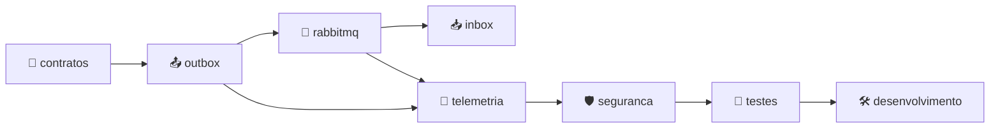

[🏠 TEC.Messaging](../README.md) › 📚 Documentação

# 📚 Documentação do TEC.Messaging

> Referência completa dos pacotes, um arquivo por tema: o README dá a visão geral; aqui ficam os detalhes.

## 📑 Sumário

- [🗂️ Temas](#️-temas)
- [🗺️ Mapa dos temas](#️-mapa-dos-temas)

---

## 🗂️ Temas

| # | Arquivo | O que responde | Principais tipos |
|:-:|---|---|---|
| 1 | [📜 Contratos de integração](contratos-de-integracao.md) | Como nomear, versionar e mapear eventos | `[IntegrationEvent]`, `IMessageTypeRegistry`, `IIntegrationEventMapper`, `MessagingBuilder` |
| 2 | [📤 Outbox](outbox.md) | Como o evento é gravado e publicado sem perda | `IOutboxStore`, `OutboxOptions`, `IOutboxAdministration`, `IOutbox`, `TecMessagingSaveChangesInterceptor` |
| 3 | [📥 Inbox](inbox.md) | Como processar cada mensagem uma única vez | `IInboxStore`, `InboxOptions` |
| 4 | [🐇 RabbitMQ](rabbitmq.md) | Topologia, consumidores, retry, DLQ e pausa | `RabbitMqOptions`, `RabbitMqConsumer`, `QueueDefinition`, `ConsumeResult`, `IDeadLetterAdministration` |
| 5 | [📡 Telemetria](telemetria.md) | Spans, métricas e correlação | `MessagingDiagnostics`, `MessageContext` |
| 6 | [🛡️ Segurança](seguranca.md) | Segredos, limites e dados sensíveis | — |
| 7 | [🧪 Testes](testes.md) | Categorias, integração local, carga e benchmarks | — |
| 8 | [🛠️ Desenvolvimento](desenvolvimento.md) | Build, modo local, lock files e publicação | — |

Fora de `docs/`: [🧰 Samples](../samples/README.md) · [⚙️ CI/CD](../.github/workflows/README.md) · [📝 Changelog](../CHANGELOG.md).

---

## 🗺️ Mapa dos temas

