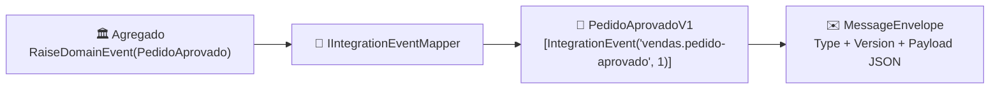

[🏠 TEC.Messaging](../README.md) › [📚 Documentação](README.md) › Contratos de integração

# 📜 Contratos de integração

> Eventos que saem do serviço têm contrato próprio, com nome e versão estáveis: o domínio pode mudar sem quebrar quem consome.

## 📑 Sumário

- [🎯 Visão geral](#-visão-geral)
- [🚀 Uso](#-uso)
- [⚙️ Opções](#️-opções)
- [❌ Erros](#-erros)
- [🛡️ Segurança](#️-segurança)
- [❓ Perguntas frequentes](#-perguntas-frequentes)

---

## 🎯 Visão geral



| Conceito | Onde vive | Muda quando |
|---|---|---|
| Evento de domínio (`IDomainEvent`, TEC.Core) | Dentro do serviço | O modelo muda (livremente) |
| Evento de integração (`[IntegrationEvent]`) | Contrato público | Nunca de forma incompatível: crie uma nova versão |

---

## 🚀 Uso

```csharp
[IntegrationEvent("vendas.pedido-aprovado", Version = 1)]
public sealed record PedidoAprovadoV1(Guid PedidoId, decimal Total);

services.AddTecMessaging()
    .AddEventTypesFromAssembly(typeof(PedidoAprovadoV1).Assembly)     // ou AddEventType<PedidoAprovadoV1>()
    .Map<PedidoAprovado>(e => new PedidoAprovadoV1(e.PedidoId, e.Total))
    .AddMapper<MapeadorDeEstoque>();                                  // mapeador com 0..N eventos
```

```csharp
internal sealed class MapeadorDeEstoque : IntegrationEventMapper<PedidoAprovado>
{
    protected override IEnumerable<object> Map(PedidoAprovado e)
    {
        foreach (var item in e.Itens)
            yield return new EstoqueReservadoV1(item.ProdutoId, item.Quantidade);
    }
}
```

**Native AOT**: registre com a metadata gerada.

```csharp
[JsonSerializable(typeof(PedidoAprovadoV1))]
internal sealed partial class ContratosJson : JsonSerializerContext;

services.AddTecMessaging().AddEventType(ContratosJson.Default.PedidoAprovadoV1);
```

**Consumidor**: desserialize pelo catálogo.

```csharp
if (registry.TryGet(envelope.Type, envelope.Version, out var info) && info.Deserialize(envelope.Payload) is PedidoAprovadoV1 evento) { ... }
```

### Regras de nome e versão

| Regra | Exemplo |
|---|---|
| Minúsculas, dígitos, `.` e `-`, até 200 caracteres | `vendas.pedido-aprovado` |
| Prefixo do serviço | `aura.chamado-aberto` |
| Mudança compatível (campo opcional novo) | Mesma versão |
| Mudança incompatível (renomear, remover, mudar tipo) | Novo tipo `...V2` com `Version = 2`; publique as duas até os consumidores migrarem |

---

## ⚙️ Opções

| Opção (`MessagingOptions`) | Padrão | Descrição |
|---|---|---|
| `MaxPayloadLength` | 256 KiB | Tamanho máximo do payload (1 KiB a 16 MiB) |
| `JsonSerializerOptions` | `JsonDefaults.Options` do TEC.Core | JSON dos contratos registrados por reflexão |

## ❌ Erros

| Exceção | Quando ocorre | O que fazer |
|---|---|---|
| `InvalidOperationException` no registro | Nome inválido, versão < 1, tipo sem `[IntegrationEvent]` | Corrija o atributo ou informe nome e versão |
| `InvalidOperationException` ao resolver o catálogo | Mesmo nome+versão para dois tipos, ou um tipo com dois nomes | Um contrato por tipo |
| `InvalidOperationException` no `SaveChanges` | Mapeador devolveu tipo não registrado ou payload grande demais | Registre o contrato; emagreça o evento |

## 🛡️ Segurança

> [!WARNING]
> Eventos viajam por broker e ficam em DLQs e logs: coloque **ids e metadados**, nunca senhas, tokens ou texto livre com
> dados pessoais. O consumidor que precisar do detalhe consulta o serviço dono.

## ❓ Perguntas frequentes

<details>
<summary><b>Posso publicar o próprio evento de domínio?</b></summary>

Pode (marque-o com `[IntegrationEvent]` e mapeie para ele mesmo), mas perde a proteção: qualquer refatoração do domínio vira
mudança de contrato.
</details>

---
⬅️ [📚 Índice](README.md) · [Outbox](outbox.md) ➡️
