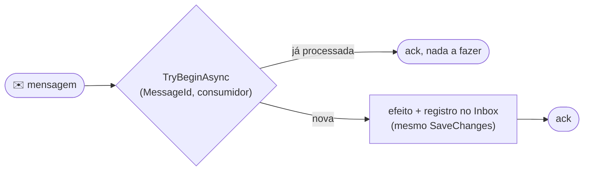

[🏠 TEC.Messaging](../README.md) › [📚 Documentação](README.md) › Inbox

# 📥 Inbox

> Entrega é "pelo menos uma vez": o Inbox faz o processamento acontecer uma única vez.

## 📑 Sumário

- [🎯 Visão geral](#-visão-geral)
- [🚀 Uso](#-uso)
- [⚙️ Opções](#️-opções)
- [❌ Erros](#-erros)
- [🛡️ Segurança](#️-segurança)
- [❓ Perguntas frequentes](#-perguntas-frequentes)

---

## 🎯 Visão geral



A chave `(MessageId, Consumer)` garante que duas entregas simultâneas não processem duas vezes: uma delas falha no commit
(chave duplicada), volta à fila e, na reentrega, `TryBeginAsync` devolve `false`.

---

## 🚀 Uso

```csharp
services.AddTecMessaging().UseSqlServer<FinanceiroDbContext>().AddInboxCleanup(o => o.Retention = TimeSpan.FromDays(30));

if (!await inbox.TryBeginAsync(message.Envelope.MessageId, "faturamento", ct))
    return ConsumeResult.Completed;
db.Faturas.Add(fatura);
await db.SaveChangesAsync(ct);
```

Efeitos fora do banco (e-mail, API externa) não entram na transação: use uma chave de idempotência própria no destino, ou
registre cada efeito (ex.: `messageId × destinatário`) antes de executá-lo.

---

## ⚙️ Opções

| Opção (`InboxOptions`) | Padrão | Descrição |
|---|---|---|
| `Retention` | 30 dias | Retenção dos registros (maior que o tempo máximo de reentrega, inclusive DLQ reprocessada) |
| `CleanupInterval` | 1 h | Intervalo da limpeza |
| `MaxConsumerLength` | 100 | Tamanho máximo do nome do consumidor (constante) |

## ❌ Erros

| Situação | Causa | O que fazer |
|---|---|---|
| `DbUpdateException` (chave duplicada) | Entrega concorrente da mesma mensagem | Normal: deixe a mensagem voltar à fila |
| Mensagem processada duas vezes | `SaveChanges` em outro contexto que não o do Inbox | Use o mesmo `DbContext` (mesmo escopo) |

## 🛡️ Segurança

> [!NOTE]
> O nome do consumidor é parte da chave: mantenha-o estável. Renomear faz mensagens antigas reentregues serem processadas de novo.

## ❓ Perguntas frequentes

<details>
<summary><b>Preciso do Inbox se o handler já é idempotente por natureza?</b></summary>

Não. Ex.: "marcar como lido" é idempotente. Use o Inbox quando o efeito acumula (inserir, somar, enviar).
</details>

---
⬅️ [Outbox](outbox.md) · [📚 Índice](README.md) · [RabbitMQ](rabbitmq.md) ➡️
