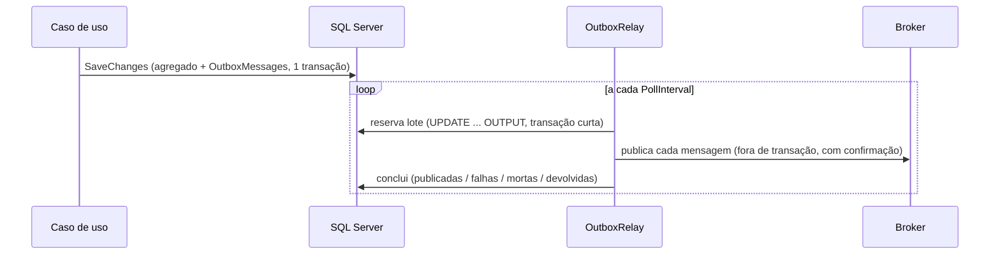

[🏠 TEC.Messaging](../README.md) › [📚 Documentação](README.md) › Outbox

# 📤 Outbox

> O evento é gravado na mesma transação do agregado e publicado depois, sem perda e sem travar o banco.

## 📑 Sumário

- [🎯 Visão geral](#-visão-geral)
- [🚀 Uso](#-uso)
- [⚙️ Opções](#️-opções)
- [❌ Erros](#-erros)
- [🛡️ Segurança](#️-segurança)
- [❓ Perguntas frequentes](#-perguntas-frequentes)

---

## 🎯 Visão geral



| Desfecho | Efeito |
|---|---|
| Publicada | `Status = Published`, removida depois de `PublishedRetention` |
| Falha | `Attempts + 1`, nova tentativa em `InitialRetryDelay × 2^(n-1)` (teto `MaxRetryDelay`). **As outras mensagens seguem** |
| Esgotou `MaxAttempts` | `Status = Dead`: não volta sozinha; o administrador reprocessa ou descarta |
| `ConsecutiveFailuresToPause` falhas seguidas | Broker fora: o resto do lote volta sem contar tentativa e o relay pausa `PauseDuration` |
| Reserva perto do fim (80%) | O resto do lote volta, para outro relay não publicar em duplicidade |

> [!NOTE]
> A ordem é a de ocorrência dentro de um lote, mas **não é garantida** entre lotes, relays e novas tentativas. Consumidores
> devem ser idempotentes ([Inbox](inbox.md)) e tolerar reordenação (ex.: comparar versões/datas).

---

## 🚀 Uso

```csharp
services.AddTecMessaging()
    .AddEventType<PedidoAprovadoV1>()
    .Map<PedidoAprovado>(e => new PedidoAprovadoV1(e.PedidoId, e.Total))
    .UseSqlServer<VendasDbContext>()
    .AddDomainEventsObserver<GravadorDeHistorico>()   // opcional: dados próprios na mesma transação
    .AddOutboxRelay(o => o.MaxAttempts = 15);         // em quantos processos quiser

services.AddDbContext<VendasDbContext>((sp, o) => o.UseSqlServer(conexao).UseTecMessaging(sp));
```

Quando o registro do contexto não expõe as opções (ex.: `AddTecOrm`), ligue o interceptor no próprio contexto:

```csharp
public sealed class VendasDbContext(DbContextOptions<VendasDbContext> options, TecMessagingSaveChangesInterceptor outbox) : DbContext(options)
{
    protected override void OnConfiguring(DbContextOptionsBuilder optionsBuilder) => optionsBuilder.AddInterceptors(outbox);

    protected override void OnModelCreating(ModelBuilder modelBuilder) => modelBuilder.AddTecMessaging("vendas");
}
```

Gere a migration depois de chamar `AddTecMessaging`. O índice das pendentes (`IX_OutboxMessages_Pending`, filtrado em
`Status = 0`, chave `OccurredAt, Id` com `NextAttemptAt` e `LeasedUntil` incluídos) segue a ordem da reserva: várias
instâncias reservam lotes ao mesmo tempo sem pular mensagens livres. Não troque a ordem das colunas dele.

Evento sem agregado (ex.: configuração alterada):

```csharp
outbox.Enqueue(new ParametrosAlteradosV1(chave));   // IOutbox: gravado no próximo SaveChanges
await db.SaveChangesAsync(ct);
```

Administração:

```csharp
var stats = await admin.GetStatisticsAsync(ct);          // Pending, PendingWithErrors, Dead, Published, OldestPendingOccurredAt
var falhas = await admin.ListFailedAsync(100, ct);
await admin.RequeueAsync(ids: null, ct);                 // mortas e com erro voltam, tentativas zeradas
await admin.DiscardAsync([id], ct);                      // só mortas
```

---

## ⚙️ Opções

| Opção (`OutboxOptions`) | Padrão | Descrição |
|---|---|---|
| `BatchSize` | 50 | Mensagens reservadas por ciclo (1 a 1000) |
| `PollInterval` | 1 s | Espera quando o lote veio incompleto |
| `LeaseDuration` | 2 min | Validade da reserva |
| `MaxAttempts` | 10 | Falhas até `Dead` |
| `InitialRetryDelay` / `MaxRetryDelay` | 2 s / 5 min | Backoff exponencial |
| `ConsecutiveFailuresToPause` / `PauseDuration` | 3 / 10 s | Pausa quando o broker parece fora |
| `PublishedRetention` / `CleanupInterval` | 7 dias / 1 h | Limpeza das publicadas |
| `StatisticsInterval` | 30 s | Atualização das métricas de pendentes (0 desliga) |

Opções inválidas falham na subida (`OptionsValidationException`).

## ❌ Erros

| Situação | Causa | O que fazer |
|---|---|---|
| `InvalidOperationException: OutboxMessage não está no modelo` | Faltou `modelBuilder.AddTecMessaging()` | Chame no `OnModelCreating` e gere a migration |
| Mensagens `Dead` | Broker recusou repetidamente (permissão, exchange inexistente, mensagem grande) | Corrija a causa e `RequeueAsync` |
| `tec.messaging.outbox.oldest_pending_age` crescendo | Relay parado ou broker fora | Verifique os logs (eventos 4001–4005) e o health check |

## 🛡️ Segurança

> [!WARNING]
> O relay publica o que está no banco: quem escreve na tabela `OutboxMessages` publica no broker. Conceda escrita só ao
> login da aplicação.

## ❓ Perguntas frequentes

<details>
<summary><b>Os eventos somem do agregado se o SaveChanges falhar?</b></summary>

Não. O interceptor só limpa os eventos depois do commit; na falha, retira do rastreamento as mensagens (e o que os
observadores adicionaram), e a nova tentativa gera tudo de novo, sem duplicar.
</details>

---
⬅️ [Contratos de integração](contratos-de-integracao.md) · [📚 Índice](README.md) · [Inbox](inbox.md) ➡️
